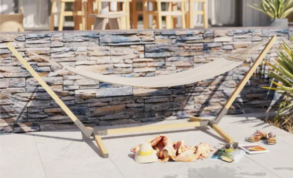
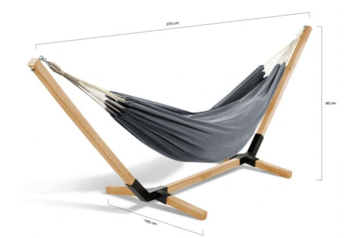
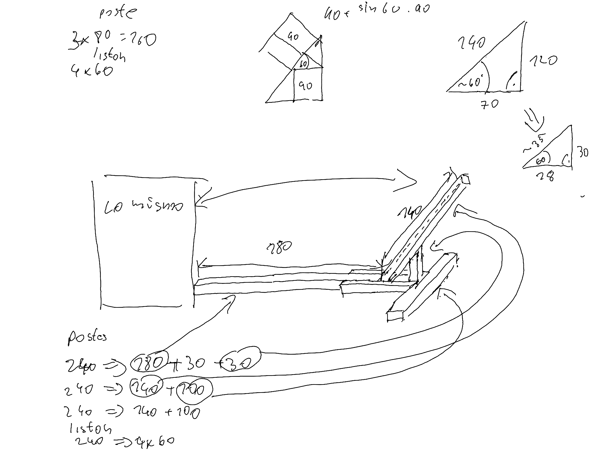

# Idea

Create a diy hammock stand.

Hammock stands usually cost >200e, e.g. [here](https://www.leroymerlin.es/search?q=soporte+de+hamaca+de+madera)

The only [cheaper](https://www.leroymerlin.es/productos/jardin-y-terraza/muebles-de-jardin/hamacas-y-tumbonas/estructura-de-hamaca-isma-de-acero-299-x-112-5-x-105-cm-83719263.html?highlightedOfferCode=c4bf1de53258cd5cb248faa8e3659fb36c806748&utm_id=20438635825&utm_campaign_id=20438635825&gad_source=1&gclsrc=ds) that I found (120e):

Or almost the same 50e [here](https://www.manomano.es/p/hamaca-con-soporte-de-madera-y-lona-gris-antracita-tahiti-82022515?model_id=86777179)
This does not look too stable...

The final idea is inspired by following DIY projects:
* https://hamacasparadise.com/producto/base-para-hamaca-color-madera/
* https://www.youtube.com/watch?app=desktop&v=sik5YbHhQJY

